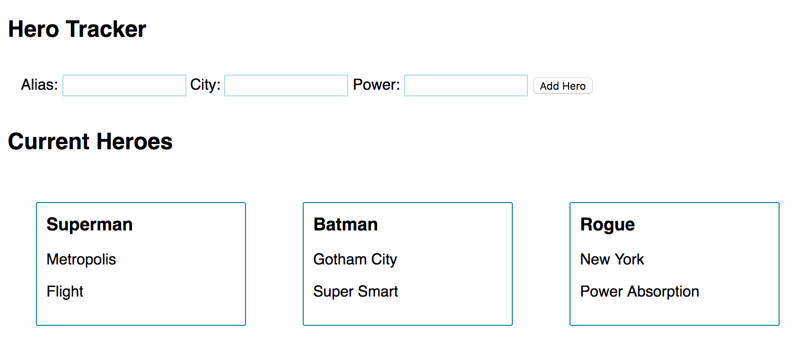

# Code Challenge 5: Angular

_A friendly reminder that this is simply a way for us to see how you are individually doing with the technology. Just relax and show us what you know!_

## Objectives
- Demonstrate understanding of interacting with an Angular Service
- Demonstrate understanding of using mongoose to retrieve data from a mongo database

## Your Hero Tracker
The Department of Superhero Knowledge needs an app to help track superhero aliases and powers. You are going to build them this app with Angular and mongo. 

### Hero Entry
This will have a form to fill out and create new heroes. Each hero will have the following information on their record:

* ```alias``` (this is their superhero name)
* ```city```
* ```power```

### Hero Listing
This should show a list of heroes and their information. On page load, all heroes currently in the database should be displayed. When a new hero is added the view should refresh automatically.

## App Interface Example



## To Get Started
- [ ] Fork and clone this repo.
- [ ] `npm install` to get all the dependancies.
- [ ] Start the server and open the site on [http://localhost:3000/](http://localhost:3000/).

Some of the code has been started for you including most of the server and the Angular `scripts/services/hero.service.js` that makes the http calls to the server.

The following files **will** need your attention:

- [ ] On the client side you will need to complete the `scripts/controllers/hero.controller.js` file. Use the `scripts/services/hero.service.js`, which is complete, to make requests to your server.

- [ ] On the server side, you will need to complete the GET hero route in the `routes/hero.js`

Files that need attention have `// TODO` comments for the changes that need to be made.  

No other files will need your attention. These files will have ``// DO NOT MODIFY`` in a comment at the top of the file.
